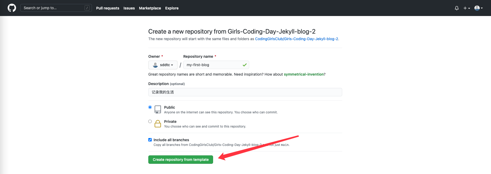
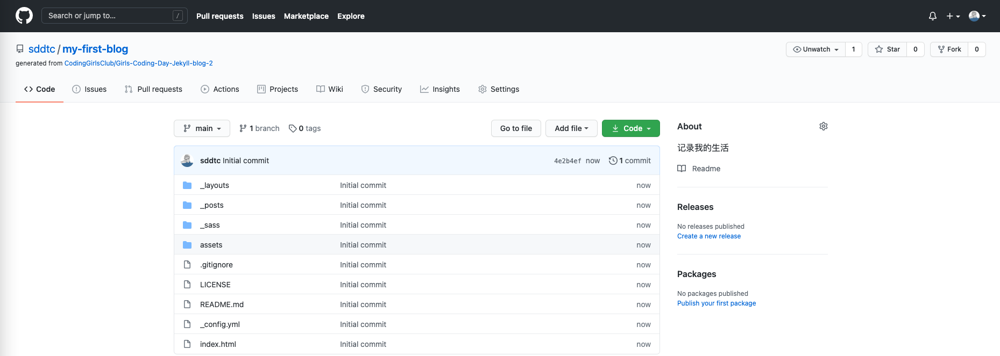
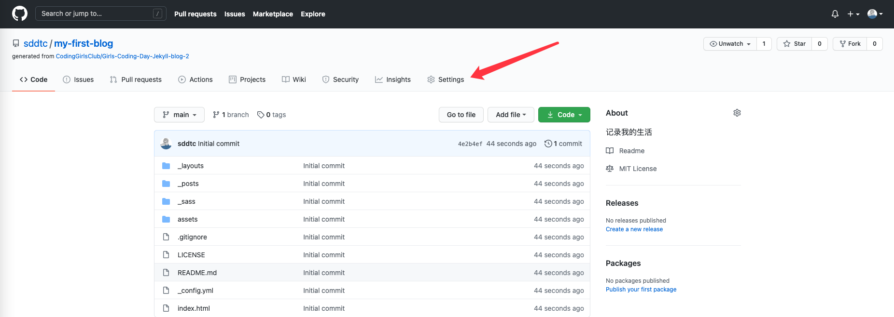

# 程序媛汇介绍
程序媛汇 Coding Girls Club (CGC)诞生于 2016 年 6 月 1 日，是一家为女性数字化赋能为己任的社会企业。CGC 通过编程科普、启蒙工作坊、职业培训等线上线下结合的形式，鼓励更多女性体验编程并进入 STEM 领域。至今，CGC 已在全国 10 个城市举办了超过 20 场编程城市活动，并联合全国 17 所高校举办“一日编程”活动，累计参与的学员近 4000 人，得到了来自中国日报、环球时报、CCTV 等媒体的报道关注。2018 年，CGC 入选由联合国开发计划署发起的“科技与慈善”项目案例集，2019 年成为共青团中央"全国青年社会组织「伙伴计划」"获奖项目。CGC 聚集着一群正直、善良且富有才华的小伙伴，致力建构互联互助的信息学习平台，为女性和女性自我提升数字化赋能，我们相信数字赋能女性，多元改变世界。
官网：http://codingirlsclub.com/about

* 搭建网站
  * 网站效果预览
  * 注册 Github 账号
  * 使用博客模版来创建属于自己的 git 仓库
  * 配置 GitHub Pages
* 自定义网站内容
  * 修改 baseurl
  * 修改网站的主题和标题
  * 提交更改合并到 git 仓库的主分支
* 发布文章
  * 发布新文章
  * 合并到 git 仓库的主分支
* 小知识
  * 什么是 Jekyll ?

# 搭建网站
## 网站效果预览

TBD

## 注册 Github 账号
请点击这里[注册 GitHub](https://github.com/join?ref_cta=Sign+up&ref_loc=header+logged+out&ref_page=%2F&source=header-home), 注册成功之后，登录 GitHub。  
如果你已经有 GitHub 账户，请跳过这一步！  

## 使用博客模版来创建属于自己的 git 仓库
1. 登录到 GitHub 之后，点击 [Girls-Coding-Day-Jekyll-blog-2](https://github.com/CodingGirlsClub/Girls-Coding-Day-Jekyll-blog-2) 进入仓库, 点击右上角的 `Use this template` 按钮。  

2. 填写仓库名称, 仓库简介, 选择仓库类型为 Public, 勾选 Include all branches. 点击 `Create repositorye from template` 按钮  

3. 仓库创建成功

## 配置 GitHub Pages
1. 找到 `Settings` 选项, 点击 `Settings`

2. 将 `Settigns` 页面下拉, 找到 `GitHub Pages` 设置区域. 点击 `Source` 下面的下拉框，选择 `main` 分支之后，点击 `Save` 按钮:  

3. 点击 `Save` 按钮之后会出现相应的博客访问地址.  
:warning: 地址还不可访问, 因此打开页面会出现 404 (找不到该页面)  

# 自定义网站内容
## 修改 baseurl

## 修改网站的主题和标题

## 提交更改合并到 git 仓库的主分支

# 发布文章
## 发布新文章

## 合并到 git 仓库的主分支

# 小知识
## 什么是 Jekyll ? 
Jekyll 是一个简单的博客形态的静态站点生成器。它有一个模版目录，其中包含原始文本格式的文档，通过一个转换器（如 Markdown）和我们的 Liquid 渲染器转化成一个完整的可发布的静态网站，你可以发布在任何你喜爱的服务器上。Jekyll 也可以运行在 `GitHub Page` 上，也就是说，你可以使用 GitHub 的服务来搭建你的项目页面、博客或者网站，而且是完全免费的。  
我们的网站就是基于 Jekyll 并运行在 `GitHub Page` :) 
